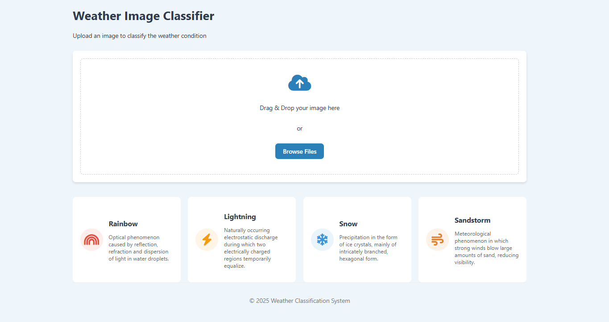
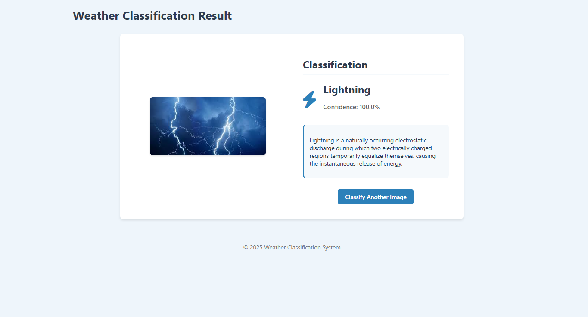

# Weather Image Classification System

A complete end-to-end system for classifying weather images into different categories (rainbow, lightning, snow, sandstorm) using deep learning with PyTorch and ResNet34.

## Project Structure
```
weather-classification/
├── notebooks/
│   ├── 01_model_training.ipynb
│   └── 02_model_evaluation.ipynb
├── src/
│   ├── app.py
│   ├── model.py
│   ├── utils.py
│   ├── templates/ 
│   │    ├── result.html
│   │    ├── index.html
│   └──static/
│       ├── css/
│       │   └── style.css
│       └── js/
│           └── script.js
├── data/
│   ├── train/
│   │   ├── rainbow/
│   │   ├── lightning/
│   │   ├── snow/
│   │   └── sandstorm/
│   ├── valid/
│   │   ├── rainbow/
│   │   ├── lightning/
│   │   ├── snow/
│   │   └── sandstorm/
│   └── test/
│       ├── rainbow/
│       ├── lightning/
│       ├── snow/
│       └── sandstorm/
├── models/
│   └── weather_classifier.pth
├── Dockerfile
├── requirements.txt
└── README.md
```

## Setup and Installation

### Prerequisites
- Python 3.9+
- PyTorch 2.0+
- Flask
- Docker (optional)

### Dataset and Model Performance

#### Dataset Size
- Training set: 170 images (split across 4 weather categories)
- Validation set: 30 images
- Test set: 30 images

#### Model Performance
- **Overall Accuracy: 98.33%** on the test set
- **Confusion Matrix Analysis:**
  - Lightning class: 30/30 correctly classified (100% accuracy)
  - Rainbow class: 29/30 correctly classified with 1 misclassification as sandstorm
  - Sandstorm class: 30/30 correctly classified (100% accuracy)
  - Snow class: 29/30 correctly classified with 1 misclassification as sandstorm
  - The model shows excellent performance with only 2 misclassifications out of 120 total test cases
  - The sandstorm class appears to occasionally be confused with rainbow and snow images
  
Note: While some individual classes achieve 100% accuracy on the test set, the confidence scores reported by the model (such as 100.0% shown in the demo) may not reflect the true uncertainty in real-world scenarios.

### Local Setup

1. Clone the repository:
```bash
git clone https://github.com/yourusername/weather-classification.git
cd weather-classification
```

2. Create a virtual environment and install dependencies:
```bash
python -m venv venv
source venv/bin/activate  # On Windows: venv\Scripts\activate
pip install -r requirements.txt
```

3. Download the pre-trained model:
   - Download the model file from [Google Drive](https://drive.google.com/file/d/1HX1cloC4rsTz_qFjtbHKGgPV9uanuiyA/view?usp=sharing)
   - Create the `models` directory if it doesn't exist already: `mkdir -p models`
   - Place the downloaded file in the `models` directory with the filename `weather_classifier.pth`

4. Prepare the dataset:
   - Download the weather dataset from [Kaggle](https://www.kaggle.com/datasets/jehanbhathena/weather-dataset)
   - Run the data preparation notebook to organize the dataset into train/valid/test splits

5. Train the model:
   - Run the model training notebook
   - The trained model will be saved to the `models/` directory

6. Start the Flask application:
```bash
python src/app.py
```

7. Open your browser and navigate to `http://localhost:5000`

### Docker Setup

1. Build the Docker image:
```bash
docker build -t weather-classifier .
```

2. Run the container:
```bash
docker run -p 5000:5000 weather-classifier
```

3. Install Docker:
```bash
# For Amazon Linux 2
sudo yum update -y
sudo amazon-linux-extras install docker
sudo service docker start
sudo usermod -a -G docker ec2-user
# Log out and log back in

# For Ubuntu
sudo apt-get update
sudo apt-get install -y docker.io
sudo systemctl start docker
sudo systemctl enable docker
sudo usermod -a -G docker ubuntu
# Log out and log back in
```

4. Clone your repository and deploy using Docker:
```bash
git clone https://github.com/yourusername/weather-classification.git
cd weather-classification
docker build -t weather-classifier .
docker run -d -p 80:5000 weather-classifier
```

5. Access your application at `http://your-instance-public-dns`

## Usage

1. Open the web interface in your browser
2. Upload an image of a weather phenomenon by dragging and dropping or using the Browse Files button
3. The system will classify the image and display the result with confidence score




The web application provides a clean interface with descriptions of each weather phenomenon:
- **Rainbow**: Optical phenomenon caused by reflection, refraction and dispersion of light in water droplets
- **Lightning**: Naturally occurring electrostatic discharge during which two electrically charged regions temporarily equalize
- **Snow**: Precipitation in the form of ice crystals, mainly of intricately branched, hexagonal form
- **Sandstorm**: Meteorological phenomenon in which strong winds blow large amounts of sand, reducing visibility

## Model Information

- Base architecture: ResNet34
- Transfer learning approach:
  - Feature extraction: All layers frozen except the last one
  - Fine-tuning: Last few layers unfrozen and retrained

## Dataset

The model is trained on the [Weather Dataset](https://www.kaggle.com/datasets/jehanbhathena/weather-dataset) from Kaggle, which includes images of various weather conditions. For this project, we focus on four categories:
- Rainbow
- Lightning
- Snow
- Sandstorm

## Future Work

Some potential improvements for future versions include:

- **Improved Confidence Calibration**: While the model achieves high accuracy, the confidence scores (sometimes showing 100%) could be better calibrated to reflect true predictive uncertainty
- **Adding More Weather Classes**: Expand beyond the current four classes to include fog, hail, cloud types, etc.
- **Data Augmentation**: Increase dataset size through augmentation techniques to improve model robustness
- **Mobile Application**: Develop a mobile version for on-the-go weather classification
- **Integration with Weather APIs**: Combine image classification with data from weather services for more comprehensive analysis
- **Regional Adaptation**: Fine-tune models for different geographical regions with distinctive weather patterns

## Acknowledgments

- [PyTorch](https://pytorch.org/) for the deep learning framework
- [Flask](https://flask.palletsprojects.com/) for the web framework
- [Kaggle](https://www.kaggle.com/) for the dataset
